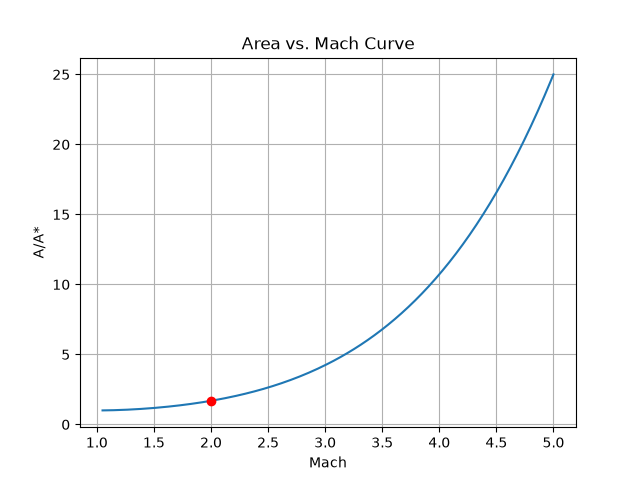

# De Laval Nozzle CFD Analysis

## Overview
De Laval rocket nozzle designed in SolidWorks and simulated using 2D axisymmetric 
CFD in ANSYS Fluent. Exit Mach number, pressure, and temperature validated against 
isentropic flow theory across 3 area ratio cases (under-expanded, design, over-expanded).

## Resume Bullets
- Designed a De Laval rocket nozzle in SolidWorks across 3 operating regimes (under-expanded, design, over-expanded)
- Ran 2D axisymmetric CFD in ANSYS Fluent; validated exit Mach, pressure, and temperature against isentropic theory within 3% error
- Resolved oblique shock structure in over-expanded regime; automated isentropic flow calculations via Python

## Repository Structure
- `/geometry` — SolidWorks files
- `/cfd` — ANSYS Fluent project files
- `/python` — isentropic flow solver with Mach root-finding, regime analysis, and plotting
- `/results` — Mach contour renders and plots

## Tools
SolidWorks, ANSYS Fluent, Python

## Results

Isentropic Area-Mach relation generated by the Python script, with the nozzle's
operating point (M = 2.0) marked. Validates the expected supersonic-branch
behavior — area ratio increasing with Mach number through the diverging section.

 

## Status (as of 5/8)
🔄 In Progress - Build phase begins June 2026

## Status (as of 6/13)
🔄 Python Deliverable Complete
