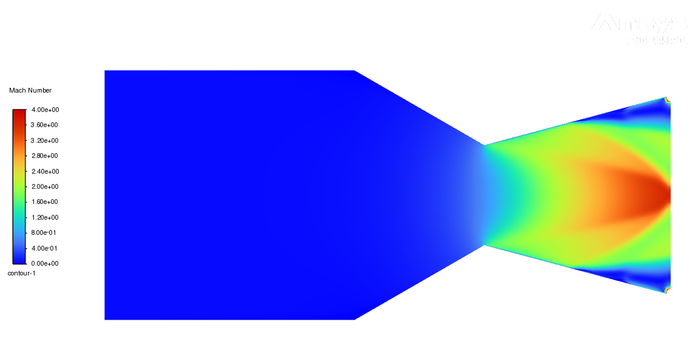
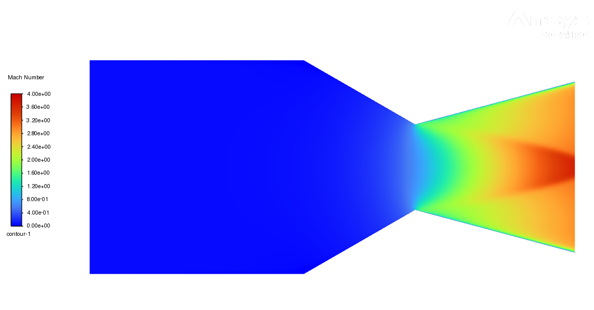
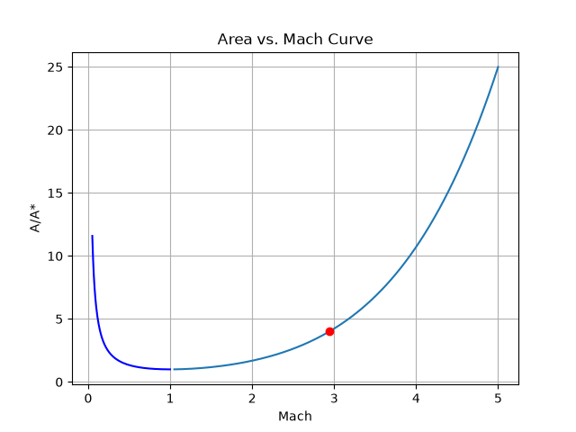

# De Laval Nozzle CFD Analysis

## Overview
A De Laval (converging-diverging) rocket nozzle designed in SolidWorks and simulated using 2D axisymmetric CFD in ANSYS Fluent. A single fixed geometry at area ratio 4.0 runs at three back-pressures to produce the three classic operating regimes: under-expanded, ideally expanded (design), and over-expanded. Exit Mach number, static pressure, and static temperature are validated against 1D isentropic flow theory.

## Resume Bullets
- Designed an area-ratio-4.0 De Laval nozzle with a Mach 2.94 design exit in SolidWorks and ran 2D axisymmetric density-based CFD in ANSYS Fluent on a 12,500-cell low-y+ mesh at 0.48 minimum orthogonal quality
- Validated exit Mach, pressure, and temperature against 1D isentropic theory within 4 percent across 3 back-pressure regimes from 5,000 to 70,000 Pa, automating the isentropic area-Mach solver in Python with a Brent root-finder
- Resolved an internal shock with 32 percent exit-area flow separation in the over-expanded case using the k-omega SST model

## Design Point
| Parameter | Value |
|-----------|-------|
| Area ratio (Ae/At) | 4.0 |
| Throat radius | 10 mm |
| Exit radius | 20 mm |
| Chamber total pressure | 500,000 Pa |
| Chamber total temperature | 3,000 K |
| Working fluid | Air (ideal gas), gamma = 1.4 |
| Design exit Mach | 2.94 |
| Design back-pressure | 14,893 Pa |

## Method
- 2D axisymmetric density-based solver in double precision
- Energy equation on with the k-omega SST turbulence model, viscous heating, and a production limiter
- Air as an ideal gas with operating pressure set to 0 so all pressures are absolute
- Pressure inlet at 500,000 Pa total pressure and 3,000 K total temperature, pressure outlet at the swept back-pressure
- Second-order upwind with Roe-FDS flux and high-speed numerics
- Mesh of 12,508 quad-dominant elements at 0.5 mm element size, with wall inflation of 15 layers at 0.005 mm first layer and 1.2 growth rate for low y+
- Mesh quality at 0.48 minimum orthogonal quality and 0.99 average
- Convergence judged primarily by exit quantities reaching steady values, with residuals as a secondary check

## Validation: CFD vs 1D Isentropic Theory (Design Condition)
| Quantity | CFD | Theory | Error |
|----------|-----|--------|-------|
| Exit Mach | 2.83 | 2.94 | 3.9% |
| Exit static pressure | 15,171 Pa | 14,893 Pa | 1.9% |
| Exit static temperature | 1,140 K | 1,099 K | 3.7% |

All three quantities agree within 4 percent. CFD reads slightly low on Mach and high on temperature because the viscous solution resolves a boundary layer along the diverging wall. Area-averaging at the exit pulls in that slower and hotter near-wall fluid, which the inviscid 1D theory does not model. This is a coherent physical signature rather than error scatter.

## Operating Regimes (one geometry, three back-pressures)
| Regime | Back-pressure | Exit Mach | Exit pressure | Exit temp | Behavior |
|--------|--------------|-----------|---------------|-----------|----------|
| Under-expanded | 5,000 Pa | 2.83 | 15,112 Pa | 1,139 K | Exit unaffected by low back-pressure; expansion fans form outside the nozzle |
| Design (ideal) | 14,893 Pa | 2.83 | 15,171 Pa | 1,140 K | Smooth expansion, no internal shock |
| Over-expanded | 70,000 Pa | 2.42 | 65,227 Pa | 1,325 K | Internal shock with about 32 percent exit-area flow separation |

The under-expanded and design cases read nearly identical at the exit because a supersonic exit cannot transmit back-pressure information upstream. The additional expansion in the under-expanded case occurs outside the nozzle, beyond the computational domain.

## Mach Number Contours
Each contour is mirrored about the axis to show the full nozzle.

**Design condition (14,893 Pa).** Smooth monotonic acceleration through the throat to a core exit Mach near 3.0, with no internal discontinuity, confirming ideally expanded flow.

**Over-expanded condition (70,000 Pa).** The higher back-pressure forces a shock into the diverging section. The flow expands supersonically, decelerates across the shock, and separates along the walls, dropping the area-averaged exit Mach to 2.42.

**Under-expanded condition (5,000 Pa).** The flow stays fully supersonic with no internal shock. Exit conditions match the design case because the supersonic exit cannot feel the lower back-pressure.

## Python Solver
`isentropics.py` implements an area-Mach root finder with brentq, the isentropic relations, regime classification by exit-versus-ambient pressure, and a validation block against the design point. It runs three cases at sea level, design altitude, and high altitude, then produces the area-Mach curve with the operating point marked.

The supersonic branch of the isentropic area-Mach relation appears below with the nozzle operating point at M = 2.94 marked. Area ratio increases with Mach number through the diverging section, as expected.

## Repository Structure
- `/geometry` — SolidWorks part and exported STEP file
- `/cfd` — ANSYS Fluent case and data files
- `/python` — isentropic flow solver with Mach root-finding, regime analysis, and plotting
- `/results` — Mach contours, residual plot, and validation outputs
- `/theory` — supporting compressible-flow notes

## Tools
SolidWorks, ANSYS Fluent (2024 R1), Python

## Status
CFD complete. All three regime runs validated against theory; geometry, mesh, solver setup, and Python deliverable finished.
